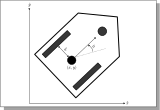
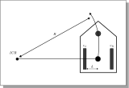
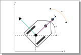
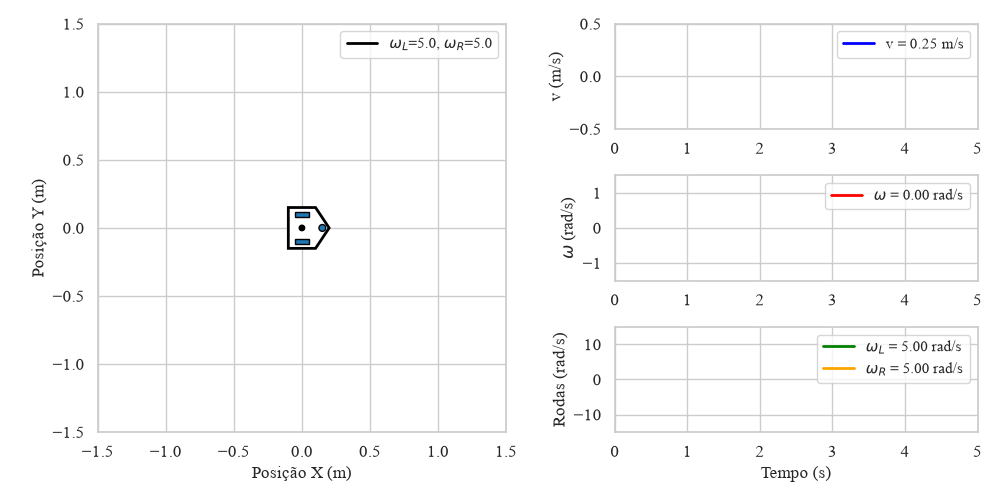
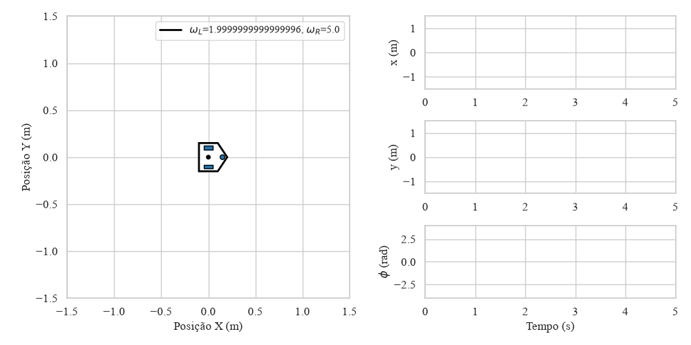

# Modelo Cinemático de Robô Diferencial

Simulação cinemática e geração de trajetórias animadas para um robô móvel com tração diferencial, validando o modelo matemático através de animações desenvolvidas em Python.

## Objetivo

Este projeto visa detalhar a dedução matemática das equações cinemáticas de um robô móvel com tração diferencial e, posteriormente, validar o modelo através de uma simulação computacional desenvolvida em Python.

## Índice

* [Pré-requisitos](#pré-requisitos)
* [Estrutura do Repositório](#estrutura-do-repositório)
* [Dedução do Modelo Cinemático](#dedução-do-modelo-cinemático)
* [Simulação em Python](#simulação-em-python)
* [Como Executar](#como-executar)
* [Autor](#autor)

## Pré-requisitos

Para executar a simulação e gerar os gráficos e animações, você precisará das seguintes bibliotecas Python:
* Python 3.x
* NumPy
* Matplotlib
* Seaborn
* Pillow (para salvar os GIFs animados)

## Estrutura do Repositório

O repositório possui a seguinte estrutura de arquivos principais:
* `diferential_robot_kinematics.py`: Script principal que executa a simulação e gera os GIFs e SVGs das trajetórias.
* `diferential_robot_trajeotory.py`: Script auxiliar de simulação de trajetória.
* `imagens/`: Diretório que contém os diagramas vetoriais utilizados na explicação matemática deste README.

## Dedução do Modelo Cinemático

### Visão Geral 
<p align="justify">
O esquema geral do robô diferencial pode ser visto na Figura 1, onde o ponto central $(x, y)$ define a posição do veículo no referencial global bidimensional, formado pelos eixos $\hat{x}$ e $\hat{y}$. A orientação atual do robô é representada pelo ângulo $\phi$ em relação à horizontal. O parâmetro $d$ indica a distância transversal do ponto central até cada uma das rodas de tração, determinando que a distância total entre as rodas (a bitola do robô) é igual a $2d$. É a partir dessa configuração geométrica que o modelo cinemático relaciona as velocidades angulares individuais da roda esquerda e da roda direita com as taxas de deslocamento linear e de rotação do sistema.
</p>

<div align="center">
  <em>Figura 1: Esquema de parâmetros do robô diferencial.</em>
  <br>
  
  <br>
  <em>Fonte: Próprio autor.</em>
</div>

O vetor de estados que representa a cinemática do robô diferencial pode ser observado na [Equação 1](#eq1).

<a id="eq1"></a>

$$
\dot{q} = [\dot{x}, \dot{y}, \dot{\phi}]^T \qquad (1)
$$

Onde:
- $\dot{x}:$ Velocidade linear instantânea do ponto de referência no eixo X global.
- $\dot{y}:$ Velocidade linear instantânea do ponto de referência no eixo Y global.
- $\dot{\phi}:$ Velocidade angular instantânea (taxa de guinada) do chassi do robô.

<p align="justify">
O comportamento desse vetor é definido pela função de cinemática direta $f(\omega_L, \omega_R)$. Essa função atua como um mapeamento matemático que recebe como entrada o giro dos motores nas juntas e entrega como resultado as velocidades do chassi no espaço operacional, onde:
</p>

- $\omega_L:$ Velocidade angular da roda esquerda.
- $\omega_R:$ Velocidade angular da roda direita.

### Dedução das Velocidades Locais

A modelagem cinemática tem início relacionando o giro independente dos motores com o movimento local do chassi do robô. 

Assumindo condição de rolamento sem deslizamento, as velocidades lineares individuais da roda esquerda ($v_L$) e da roda direita ($v_R$) são apresentadas, respectivamente, na [Equação 2](#eq2) e na [Equação 3](#eq3), dadas pela multiplicação de suas velocidades angulares pelo raio $r$ do pneu:

<a id="eq2"></a>

$$
v_L = \omega_L \cdot r \qquad (2)
$$

<a id="eq3"></a>

$$
v_R = \omega_R \cdot r \qquad (3)
$$

Como as rodas estão alinhadas em um eixo rígido de comprimento $2d$ (bitola), qualquer diferença de velocidade entre elas faz o robô orbitar em torno de um Centro Instantâneo de Rotação (ICR). A partir da geometria desse movimento orbital, ilustrada na Figura 2, calculam-se as velocidades resultantes no ponto médio do eixo do robô.

<div align="center">
  <em>Figura 2: Esquema de parâmetros do robô diferencial e o ICR.</em>
  <br>
  
  <br>
  <em>Fonte: Próprio autor.</em>
</div>

A velocidade linear resultante $v$, que translada o chassi, é expressa pela média aritmética das velocidades das rodas, conforme a [Equação 4](#eq4):

<a id="eq4"></a>

$$
v = \frac{v_R + v_L}{2} = \frac{r(\omega_R + \omega_L)}{2} \qquad (4)
$$

A velocidade angular $\omega$, que rotaciona o chassi em torno do próprio eixo, é descrita na [Equação 5](#eq5), sendo gerada pela diferença de velocidade entre as rodas dividida pela distância $2d$:

<a id="eq5"></a>

$$
\omega = \frac{v_R - v_L}{2d} = \frac{r(\omega_R - \omega_L)}{2d} \qquad (5)
$$

O comportamento cinemático resultante é apresentado na Figura 3.

<div align="center">
  <em>Figura 3: Esquema de movimento do robô diferencial.</em>
  <br>
  
  <br>
  <em>Fonte: Próprio autor.</em>
</div>

### Projeção no Referencial Global

As variáveis $v$ e $\omega$ descrevem o movimento apenas no referencial local do robô. A projeção desse movimento no referencial global $\{X, Y\}$ é realizada utilizando a orientação atual $\phi$. 

A decomposição trigonométrica da velocidade linear gera as taxas de variação nas coordenadas cartesianas, mostradas na [Equação 6](#eq6) e na [Equação 7](#eq7), enquanto a velocidade angular local corresponde à taxa de variação da orientação global indicada na [Equação 8](#eq8):

<a id="eq6"></a>

$$
\dot{x} = v \cdot \cos(\phi) \qquad (6)
$$

<a id="eq7"></a>

$$
\dot{y} = v \cdot \sin(\phi) \qquad (7)
$$

<a id="eq8"></a>

$$
\dot{\phi} = \omega \qquad (8)
$$

A substituição das expressões deduzidas de $v$ e $\omega$ nestas equações globais resulta no sistema linear que compõe a matriz Jacobiana, apresentada na [Equação 9](#eq9).

<a id="eq9"></a>

$$
\begin{bmatrix} \dot{x} \\ \dot{y} \\ \dot{\phi} \end{bmatrix} = \begin{bmatrix} \frac{r}{2}\cos(\phi) & \frac{r}{2}\cos(\phi) \\ \frac{r}{2}\sin(\phi) & \frac{r}{2}\sin(\phi) \\ \frac{r}{2d} & -\frac{r}{2d} \end{bmatrix} \begin{bmatrix} \omega_R \\ \omega_L \end{bmatrix} \qquad (9)
$$

Onde:
- $r$: Raio das rodas motrizes.
- $d$: Distância do centro do eixo até cada roda (sendo $2d$ a bitola total do robô).
- $\omega_R$ e $\omega_L$: Velocidades angulares das rodas direita e esquerda, respectivamente.

## Simulação em Python

A transição da modelagem matemática para o ambiente de simulação em Python foi realizada mapeando diretamente as equações da cinemática para uma estrutura de laço de repetição. Utilizando a biblioteca NumPy, as taxas de variação espaciais puderam ser calculadas a cada incremento de tempo, seja de forma escalar ou através da multiplicação da matriz Jacobiana pelo vetor de velocidades das rodas.

Como o modelo matemático descreve um sistema de tempo contínuo e o computador processa dados de forma discreta, a simulação utiliza o método de integração numérica de Euler de primeira ordem. Para isso, define-se um intervalo de amostragem constante, representado no código por $\Delta t$ (ou $dt$).

A cada passo iterativo, o algoritmo calcula as velocidades instantâneas no referencial global ($\dot{x}$, $\dot{y}$ e $\dot{\phi}$) utilizando a orientação $\phi$ do instante anterior. O estado atualizado do robô é então obtido somando o estado passado com o deslocamento calculado para aquele pequeno intervalo de tempo, resultando na seguinte lógica de atualização:

$$x[i]=x[i-1]+\dot{x}\cdot dt$$

$$y[i]=y[i-1]+\dot{y}\cdot dt$$

$$\phi[i]=\phi[i-1]+\dot{\phi}\cdot dt$$

Através dessa acumulação iterativa, a simulação consegue projetar a evolução temporal completa da postura do robô, permitindo traçar sua trajetória no plano cartesiano de maneira fiel à matemática do modelo não-holonômico.

## Resultados da Simulação

Para validar a modelagem cinemática e a implementação matricial, o algoritmo foi testado em quatro cenários de movimentação distintos. Acompanhe abaixo os resultados gráficos demonstrando a trajetória no plano XY e a evolução temporal dos estados de posição e orientação.

### Movimentação para Frente

Neste primeiro cenário de teste, ambas as rodas recebem a mesma velocidade angular positiva. Como não há diferença de velocidade entre as rodas motrizes, a taxa de variação da orientação do robô é nula. O resultado é um deslocamento puramente translacional em linha reta para frente.

<div align="center">
  <em>Figura 4: Animação do movimento para frente.</em>
  <br>
  
  <br>
  <em>Fonte: Elaborado pelo autor.</em>
</div>

### Movimentação para Trás

De forma análoga ao movimento para frente, aqui as rodas direita e esquerda giram com a mesma velocidade angular, porém com valores negativos. O robô descreve um movimento retilíneo em marcha à ré, sem sofrer nenhuma alteração em sua orientação inicial.

<div align="center">
  <em>Figura 5: Animação do movimento para trás.</em>
  <br>
  
  <br>
  <em>Fonte: Elaborado pelo autor.</em>
</div>

### Curva à Esquerda

Para realizar uma trajetória em curva à esquerda, a roda direita gira com uma velocidade angular maior que a roda esquerda. Essa diferença de velocidades gera uma taxa de rotação positiva no referencial global. Isso faz com que o robô altere sua orientação no sentido anti-horário enquanto avança pelo plano.

<div align="center">
  <em>Figura 6: Animação da curva à esquerda.</em>
  <br>
  
  <br>
  <em>Fonte: Elaborado pelo autor.</em>
</div>

### Curva à Direita

O movimento de curva à direita é executado aplicando uma velocidade angular maior na roda esquerda em comparação à roda direita. O efeito cinemático é uma taxa de rotação negativa, que altera a orientação do chassi no sentido horário ao longo da integração temporal.

<div align="center">
  <em>Figura 7: Animação da curva à direita.</em>
  <br>
  
  <br>
  <em>Fonte: Elaborado pelo autor.</em>
</div>

## Como Executar

1. Clone este repositório para a sua máquina local:
   ```bash
   git clone https://github.com/matheuzxc/differential-robot-model.git
   ```
2. Acesse o diretório do projeto:
   ```bash
   cd differential-robot-model
   ```
3. (Opcional) Ative o ambiente virtual já incluso (ou crie um novo):
   ```bash
   # No Windows:
   .\venv\Scripts\activate
   # No Linux/Mac:
   source venv/bin/activate
   ```
4. Instale as dependências usando o arquivo de requisitos:
   ```bash
   pip install -r requirements.txt
   ```
5. Execute a simulação:
   ```bash
   python diferential_robot_kinematics.py
   ```
6. Aguarde a finalização do script. Os arquivos `.gif` e `.svg` referentes aos movimentos executados serão salvos na pasta `imagens/`.

## Autor

Matheus Nunes Franco - 
Engenharia Mecatrônica - UFSC Joinville