# Modelos Cinemáticos: Robô Diferencial e Ackermann

Este repositório contém as simulações cinemáticas e geração de trajetórias para dois modelos clássicos de robôs móveis: **Tração Diferencial** e **Direção de Ackermann**.

Abaixo está o detalhamento matemático e a análise visual das simulações unificadas de ambos os modelos.

---

## Parte 1: Robô Diferencial

Simulação cinemática e geração de trajetórias animadas para um robô móvel com tração diferencial, validando o modelo matemático através de animações desenvolvidas em Python.

## Objetivo

Este projeto visa detalhar a dedução matemática das equações cinemáticas de um robô móvel com tração diferencial e, posteriormente, validar o modelo através de uma simulação computacional desenvolvida em Python.

## Índice - Robô Diferencial

* [Pré-requisitos](#pré-requisitos)
* [Estrutura do Repositório](#estrutura-do-repositório)
* [Dedução do Modelo Cinemático](#dedução-do-modelo-cinemático)
* [Simulação em Python](#simulação-em-python)
* [Como Executar](#como-executar)
* [Autor](#autor)

## Pré-requisitos

Para executar a simulação e gerar os gráficos e animações, você precisará das seguintes bibliotecas Python:
* Python 3.x
* NumPy
* Matplotlib
* Seaborn
* Pillow (para salvar os GIFs animados)

## Estrutura do Repositório

O repositório possui a seguinte estrutura de arquivos principais:
* `diferential_robot_kinematics.py`: Script principal que executa a simulação e gera os GIFs e SVGs das trajetórias.
* `diferential_robot_trajeotory.py`: Script auxiliar de simulação de trajetória.
* `imagens/`: Diretório que contém os diagramas vetoriais utilizados na explicação matemática deste README.

## Dedução do Modelo Cinemático

### Visão Geral 
<p align="justify">
O esquema geral do robô diferencial pode ser visto na Figura 1, onde o ponto central $(x, y)$ define a posição do veículo no referencial global bidimensional, formado pelos eixos $\hat{x}$ e $\hat{y}$. A orientação atual do robô é representada pelo ângulo $\phi$ em relação à horizontal. O parâmetro $d$ indica a distância transversal do ponto central até cada uma das rodas de tração, determinando que a distância total entre as rodas (a bitola do robô) é igual a $2d$. É a partir dessa configuração geométrica que o modelo cinemático relaciona as velocidades angulares individuais da roda esquerda e da roda direita com as taxas de deslocamento linear e de rotação do sistema.
</p>

<div align="center">
  <em>Figura 1: Esquema de parâmetros do robô diferencial.</em>
  <br>
  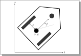
  <br>
  <em>Fonte: Adaptado de Lynch e Park (2017).</em>
</div>

O vetor de estados que representa a cinemática do robô diferencial pode ser observado na [Equação 1](#eq1).

<a id="eq1"></a>

$$
\dot{q} = [\dot{x}, \dot{y}, \dot{\phi}]^T \qquad (1)
$$

Onde:
- $\dot{x}:$ Velocidade linear instantânea do ponto de referência no eixo X global.
- $\dot{y}:$ Velocidade linear instantânea do ponto de referência no eixo Y global.
- $\dot{\phi}:$ Velocidade angular instantânea (taxa de guinada) do chassi do robô.

<p align="justify">
O comportamento desse vetor é definido pela função de cinemática direta $f(\omega_L, \omega_R)$. Essa função atua como um mapeamento matemático que recebe como entrada o giro dos motores nas juntas e entrega como resultado as velocidades do chassi no espaço operacional, onde:
</p>

- $\omega_L:$ Velocidade angular da roda esquerda.
- $\omega_R:$ Velocidade angular da roda direita.

### Dedução das Velocidades Locais

A modelagem cinemática tem início relacionando o giro independente dos motores com o movimento local do chassi do robô, partindo de restrições geométricas fundamentais.

A principal premissa matemática assume **restrições de não-capotamento e não-escorregamento**. Isto é, as rodas mantêm contato constante com o solo (sem tombar) e realizam um movimento de rolamento puro (sem derrapar lateralmente ou patinar longitudinalmente). Sob essas condições, as velocidades lineares individuais da roda esquerda ($v_L$) e da roda direita ($v_R$) são dadas, respectivamente, na [Equação 2](#eq2) e na [Equação 3](#eq3), obtidas pela multiplicação de suas velocidades angulares pelo raio $r$ do pneu:

<a id="eq2"></a>

$$
v_L = \omega_L \cdot r \qquad (2)
$$

<a id="eq3"></a>

$$
v_R = \omega_R \cdot r \qquad (3)
$$

Como as rodas estão alinhadas em um eixo rígido de comprimento $2d$ (bitola), qualquer diferença de velocidade entre elas ($v_R \neq v_L$) faz o robô orbitar em torno de um Centro Instantâneo de Rotação (ICR). A geometria desse movimento orbital é ilustrada na Figura 2, onde o parâmetro $R$ denota a distância (raio de curvatura) do centro geométrico do robô até o ICR. É a partir dessa relação geométrica de triângulos semelhantes que se calculam as velocidades resultantes no ponto médio do eixo do robô.

<div align="center">
  <em>Figura 2: Esquema de parâmetros do robô diferencial e o ICR.</em>
  <br>
  
  <br>
  <em>Fonte: Adaptado de Lynch e Park (2017).</em>
</div>

A velocidade linear resultante $v$, que translada o chassi, é expressa pela média aritmética das velocidades das rodas, conforme a [Equação 4](#eq4):

<a id="eq4"></a>

$$
v = \frac{v_R + v_L}{2} = \frac{r(\omega_R + \omega_L)}{2} \qquad (4)
$$

A velocidade angular $\omega$, que rotaciona o chassi em torno do próprio eixo, é descrita na [Equação 5](#eq5), sendo gerada pela diferença de velocidade entre as rodas dividida pela distância $2d$:

<a id="eq5"></a>

$$
\omega = \frac{v_R - v_L}{2d} = \frac{r(\omega_R - \omega_L)}{2d} \qquad (5)
$$

O comportamento cinemático resultante da combinação dessas duas componentes é apresentado na Figura 3. Nela, observa-se que o vetor de velocidade linear $v$ (em azul) atua sempre na direção longitudinal da orientação atual $\phi$, sendo responsável por transladar o chassi pelo plano. Simultaneamente, a velocidade angular $\omega$ (em laranja) atua em torno do centro do eixo trator, sendo responsável por alterar instantaneamente essa mesma orientação $\phi$.

<div align="center">
  <em>Figura 3: Esquema de movimento do robô diferencial.</em>
  <br>
  
  <br>
  <em>Fonte: Adaptado de Lynch e Park (2017).</em>
</div>

### Projeção no Referencial Global

As variáveis $v$ e $\omega$ descrevem o movimento apenas no referencial local do robô. A projeção desse movimento no referencial global $\{X, Y\}$ é realizada utilizando a orientação atual $\phi$. 

A decomposição trigonométrica da velocidade linear gera as taxas de variação nas coordenadas cartesianas, mostradas na [Equação 6](#eq6) e na [Equação 7](#eq7), enquanto a velocidade angular local corresponde à taxa de variação da orientação global indicada na [Equação 8](#eq8):

<a id="eq6"></a>

$$
\dot{x} = v \cdot \cos(\phi) \qquad (6)
$$

<a id="eq7"></a>

$$
\dot{y} = v \cdot \sin(\phi) \qquad (7)
$$

<a id="eq8"></a>

$$
\dot{\phi} = \omega \qquad (8)
$$

A substituição das expressões deduzidas de $v$ e $\omega$ nestas equações globais resulta no sistema linear que compõe a matriz Jacobiana, apresentada na [Equação 9](#eq9).

<a id="eq9"></a>

$$
\begin{bmatrix} \dot{x} \\ \dot{y} \\ \dot{\phi} \end{bmatrix} = \begin{bmatrix} \frac{r}{2}\cos(\phi) & \frac{r}{2}\cos(\phi) \\ \frac{r}{2}\sin(\phi) & \frac{r}{2}\sin(\phi) \\ \frac{r}{2d} & -\frac{r}{2d} \end{bmatrix} \begin{bmatrix} \omega_R \\ \omega_L \end{bmatrix} \qquad (9)
$$

Onde:
- $r$: Raio das rodas motrizes.
- $d$: Distância do centro do eixo até cada roda (sendo $2d$ a bitola total do robô).
- $\omega_R$ e $\omega_L$: Velocidades angulares das rodas direita e esquerda, respectivamente.

## Simulação em Python

A transição da modelagem matemática para o ambiente de simulação em Python foi realizada mapeando diretamente as equações da cinemática para uma estrutura de laço de repetição. Utilizando a biblioteca NumPy, as taxas de variação espaciais puderam ser calculadas a cada incremento de tempo, seja de forma escalar ou através da multiplicação da matriz Jacobiana pelo vetor de velocidades das rodas.

Como o modelo matemático descreve um sistema de tempo contínuo e o computador processa dados de forma discreta, a simulação utiliza o método de integração numérica de Euler de primeira ordem. Para isso, define-se um intervalo de amostragem constante, representado no código por $\Delta t$ (ou $dt$).

A cada passo iterativo, o algoritmo calcula as velocidades instantâneas no referencial global ($\dot{x}$, $\dot{y}$ e $\dot{\phi}$) utilizando a orientação $\phi$ do instante anterior. O estado atualizado do robô é então obtido somando o estado passado com o deslocamento calculado para aquele pequeno intervalo de tempo, resultando na seguinte lógica de atualização:

$$x[i]=x[i-1]+\dot{x}\cdot dt$$

$$y[i]=y[i-1]+\dot{y}\cdot dt$$

$$\phi[i]=\phi[i-1]+\dot{\phi}\cdot dt$$

Através dessa acumulação iterativa, a simulação consegue projetar a evolução temporal completa da postura do robô, permitindo traçar sua trajetória no plano cartesiano de maneira fiel à matemática do modelo não-holonômico.

### Estrutura e Funcionamento do Código

Para garantir a máxima clareza pedagógica e alinhar a simulação com a teoria, a implementação no script **`diferential_robot_kinematics.py`** foi rigorosamente dividida em duas funções centrais. É fundamental compreender a diferença exata entre os **dados de entrada (Inputs)** e os **resultados calculados (Outputs)** em cada uma delas:

#### 1. Cinemática Inversa (`simular_cinematica_inversa(v, w)`)
A cinemática inversa responde à pergunta: *"Se eu quero que o robô faça um determinado movimento no espaço, quão rápido cada motor deve girar?"* É utilizada para **controle e planejamento de trajetória**.
- **Entradas (Inputs):** O movimento espacial **desejado** para o chassi. Consiste na velocidade linear ($v$) em metros por segundo, e na velocidade angular ($\omega$) em radianos por segundo.
- **Saídas (Outputs):** Os comandos que devem ser enviados aos motores. O algoritmo calcula e retorna as velocidades angulares estritamente necessárias para a Roda Esquerda ($\omega_L$) e para a Roda Direita ($\omega_R$).
- **Matemática Aplicada:** $\omega_R = \frac{v + d \cdot \omega}{r}$ e $\omega_L = \frac{v - d \cdot \omega}{r}$.

#### 2. Cinemática Direta (`simular_cinematica(wL, wR)`)
A cinemática direta responde à pergunta: *"Se eu aplicar essas velocidades específicas nos motores, qual será o caminho físico que o robô vai percorrer?"* É utilizada para **odometria e simulação**.
- **Entradas (Inputs):** A ação mecânica **real** nos motores. Consiste unicamente nas velocidades angulares aplicadas na Roda Esquerda ($\omega_L$) e Roda Direita ($\omega_R$).
- **Saídas (Outputs):** O estado resultante no referencial global bidimensional. O algoritmo integra numericamente o movimento e devolve a postura contínua do veículo ao longo do tempo: Posição $x(t)$, Posição $y(t)$ e Orientação $\phi(t)$.

Ao final da simulação, o código utiliza os recursos de animação e *patches* (formas geométricas) da biblioteca `matplotlib` para desenhar iterativamente o robô percorrendo o caminho, gerando as figuras estáticas (SVG) e as animações (GIF) apresentadas neste repositório.

### Resultados da Simulação e Análise dos Painéis

Para refletir com exatidão a diferença entre a Cinemática Inversa e a Cinemática Direta, os resultados visuais gerados pelas simulações foram estruturados em dois painéis analíticos com comportamentos distintos:

- **Painel Esquerdo (Trajetória X-Y):** Em todos os testes, exibe o plano espacial bidimensional, plotando o caminho físico percorrido pelo robô. A sobreposição da geometria do chassi auxilia na visualização imediata da orientação instantânea.
- **Painel Direito (Evolução Temporal Focada no Tipo de Cinemática):** 
  - Nos testes de **Cinemática Inversa** (Figuras 4 a 7), o foco da análise é a obtenção das velocidades. Portanto, os gráficos plotam as **Entradas Alvo** ($v$ e $\omega$ constantes definidas pelo usuário) e as **Saídas Calculadas** (velocidades das rodas $\omega_L$ e $\omega_R$ resultantes da matemática).
  - Nos testes de **Cinemática Direta** (Figuras 8 a 11), o foco da análise é a evolução no espaço. Portanto, os gráficos apresentam as variáveis de estado de postura resultantes da integração passo a passo: Posição $x$, Posição $y$ e Orientação $\phi$.

## Simulação da Cinemática Inversa (Comandos de Movimentação)

Para validar o comportamento cinemático a partir de comandos de movimentação, foram definidas velocidades-alvo para o chassi ($v$, $\omega$). A função de cinemática inversa calcula as velocidades angulares necessárias nas rodas ($\omega_L$, $\omega_R$) para atingir o movimento desejado. Em seguida, essas velocidades são aplicadas na simulação da cinemática direta para gerar a trajetória resultante.

### Movimentação para Frente

Neste cenário, o comando de entrada é uma velocidade linear positiva ($v = 0.25$ m/s) com velocidade angular nula ($\omega = 0$). A cinemática inversa determina que ambas as rodas devem girar com a mesma velocidade angular. O resultado é um deslocamento puramente translacional em linha reta.

<div align="center">
  <em>Figura 4: Animação do movimento para frente.</em>
  <br>
  
  <br>
  <em>Fonte: Elaborado pelo autor.</em>
</div>

### Movimentação para Trás

De forma análoga, o comando de entrada é uma velocidade linear negativa ($v = -0.25$ m/s) com velocidade angular nula. A cinemática inversa retorna velocidades angulares iguais e negativas para ambas as rodas, resultando em um deslocamento retilíneo em marcha à ré.

<div align="center">
  <em>Figura 5: Animação do movimento para trás.</em>
  <br>
  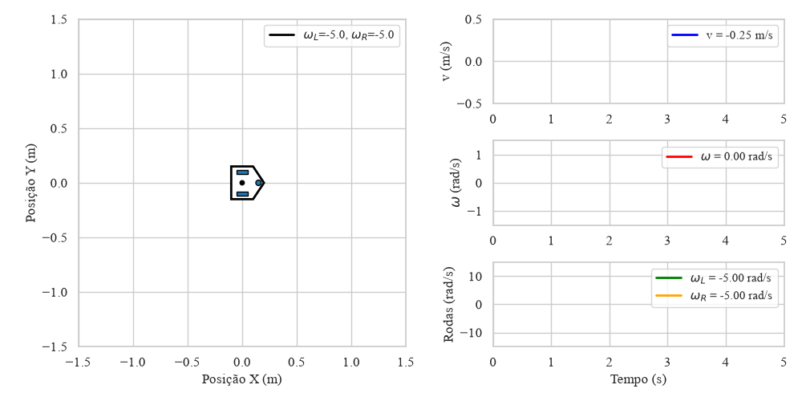
  <br>
  <em>Fonte: Elaborado pelo autor.</em>
</div>

### Curva à Esquerda

Para realizar uma curva à esquerda, o comando de entrada combina velocidade linear ($v = 0.175$ m/s) com velocidade angular positiva ($\omega = 0.75$ rad/s). A cinemática inversa calcula que a roda direita deve girar mais rápido que a esquerda, gerando uma taxa de rotação no sentido anti-horário.

<div align="center">
  <em>Figura 6: Animação da curva à esquerda.</em>
  <br>
  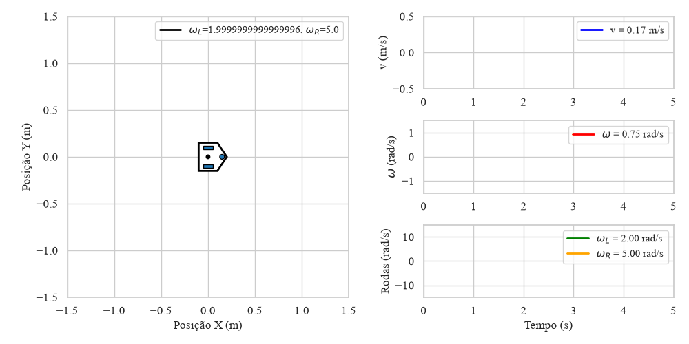
  <br>
  <em>Fonte: Elaborado pelo autor.</em>
</div>

### Curva à Direita

O comando de entrada combina velocidade linear ($v = 0.175$ m/s) com velocidade angular negativa ($\omega = -0.75$ rad/s). A cinemática inversa calcula que a roda esquerda deve girar mais rápido, resultando em uma rotação no sentido horário.

<div align="center">
  <em>Figura 7: Animação da curva à direita.</em>
  <br>
  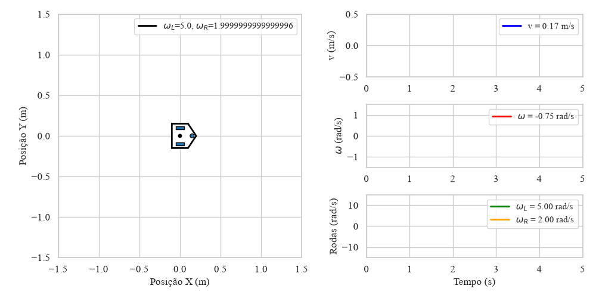
  <br>
  <em>Fonte: Elaborado pelo autor.</em>
</div>

## Simulação da Cinemática Direta via Integração Numérica

Nesta etapa, as velocidades angulares das rodas ($\omega_L$, $\omega_R$) são fornecidas diretamente como entrada, sem passar pela cinemática inversa. O algoritmo de integração de Euler calcula a postura contínua do veículo $(x(t), y(t), \phi(t))$ ao longo do tempo.

### Movimentação para Frente

As rodas recebem velocidades angulares iguais e positivas ($\omega_L = 5.0$ rad/s, $\omega_R = 5.0$ rad/s). A integração numérica revela que a velocidade linear resultante é positiva e a velocidade angular é nula, produzindo um deslocamento retilíneo para frente.

<div align="center">
  <em>Figura 8: Animação do movimento para frente (Cinemática Direta).</em>
  <br>
  
  <br>
  <em>Fonte: Elaborado pelo autor.</em>
</div>

### Movimentação para Trás

As rodas recebem velocidades angulares iguais e negativas ($\omega_L = -5.0$ rad/s, $\omega_R = -5.0$ rad/s). A integração resulta em um deslocamento retilíneo em marcha à ré, sem alteração na orientação.

<div align="center">
  <em>Figura 9: Animação do movimento para trás (Cinemática Direta).</em>
  <br>
  
  <br>
  <em>Fonte: Elaborado pelo autor.</em>
</div>

### Curva à Esquerda

As rodas recebem velocidades angulares distintas ($\omega_L = 2.0$ rad/s, $\omega_R = 5.0$ rad/s). Como a roda direita gira mais rápido, a integração numérica produz uma trajetória curvilínea com rotação no sentido anti-horário.

<div align="center">
  <em>Figura 10: Animação da curva à esquerda (Cinemática Direta).</em>
  <br>
  
  <br>
  <em>Fonte: Elaborado pelo autor.</em>
</div>

### Curva à Direita

As rodas recebem velocidades angulares distintas ($\omega_L = 5.0$ rad/s, $\omega_R = 2.0$ rad/s). Como a roda esquerda gira mais rápido, a integração numérica produz uma trajetória curvilínea com rotação no sentido horário.

<div align="center">
  <em>Figura 11: Animação da curva à direita (Cinemática Direta).</em>
  <br>
  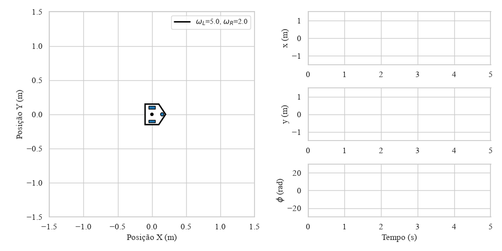
  <br>
  <em>Fonte: Elaborado pelo autor.</em>
</div>


---

## Parte 2: Robô Ackermann - Dedução do Modelo Cinemático


### Visão Geral 
<p align="justify">
O modelo de direção Ackermann é amplamente utilizado em veículos de quatro rodas, como automóveis. O ponto de referência $(x, y)$ define a posição do centro do eixo traseiro do veículo no referencial global bidimensional. A orientação atual do robô é representada pelo ângulo $\theta$ em relação à horizontal. O parâmetro $L$ indica a distância entre o eixo traseiro e o eixo dianteiro (distância entre eixos ou wheelbase). O controle do veículo é feito ajustando a velocidade linear $v$ nas rodas traseiras e o ângulo de esterçamento $\psi$ das rodas dianteiras.
</p>


<div align="center">
  <em>Figura 2: Esquema de parâmetros do robô Ackermann e o ICR.</em>
  <br>
  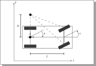
  <br>
  <em>Fonte: Adaptado de Lynch e Park (2017).</em>
</div>


O vetor de estados que representa a cinemática do robô Ackermann pode ser observado na [Equação 1](#eq1).

<a id="eq1"></a>

$$
\dot{q} = [\dot{x}, \dot{y}, \dot{\theta}]^T \qquad (1)
$$

Onde:
- $\dot{x}:$ Velocidade linear instantânea do ponto de referência no eixo X global.
- $\dot{y}:$ Velocidade linear instantânea do ponto de referência no eixo Y global.
- $\dot{\theta}:$ Velocidade angular instantânea (taxa de guinada) do chassi do robô.

<p align="justify">
O comportamento desse vetor é definido pelo mapeamento matemático que recebe como entrada a velocidade linear e o ângulo de esterçamento, onde:
</p>

- $v:$ Velocidade linear no centro do eixo traseiro.
- $\psi:$ Ângulo de esterçamento (direção) das rodas dianteiras.
- $L:$ Distância entre eixos (wheelbase).

### Dedução das Velocidades e Modelo de Bicicleta

A modelagem cinemática de um veículo com direção Ackermann de quatro rodas é frequentemente simplificada pelo **Modelo de Bicicleta (Bicycle Model)**. Neste modelo, assumimos que as duas rodas dianteiras e as duas rodas traseiras podem ser representadas por uma única roda virtual no centro de cada eixo, conectadas por um chassi rígido de comprimento $L$.

Assumindo a condição de rolamento puro (sem deslizamento lateral), a velocidade das rodas traseiras deve apontar estritamente na direção longitudinal do veículo. Como o ponto de referência $(x,y)$ está localizado no centro do eixo traseiro, o deslocamento no referencial global $\{X, Y\}$ é obtido decompondo a velocidade linear $v$ pela orientação $\theta$, gerando as taxas de variação nas coordenadas cartesianas expressas na [Equação 2](#eq2) e na [Equação 3](#eq3):

<a id="eq2"></a>

$$
\dot{x} = v \cdot \cos(\theta) \qquad (2)
$$

<a id="eq3"></a>

$$
\dot{y} = v \cdot \sin(\theta) \qquad (3)
$$

Para determinar a taxa de rotação do chassi ($\dot{\theta}$), precisamos analisar o Centro Instantâneo de Rotação (ICR). Durante uma curva, o veículo rotaciona em torno desse ponto (ICR). 
Geometricamente, o ICR é encontrado na interseção de duas retas perpendiculares aos vetores de velocidade das rodas:
1. Uma reta perpendicular à roda traseira (que se estende ao longo do eixo traseiro).
2. Uma reta perpendicular à roda dianteira, que está esterçada em um ângulo $\psi$.

Isso forma um triângulo retângulo cuja base é a distância entre eixos $L$ e o cateto adjacente ao ângulo $\psi$ (no ICR) é o raio de curvatura $R$, medido do centro do eixo traseiro até o ICR. Pela relação trigonométrica desse triângulo, temos:

$$
\tan(\psi) = \frac{L}{R} \implies R = \frac{L}{\tan(\psi)}
$$

A velocidade angular $\dot{\theta}$ do veículo é dada pela relação entre a velocidade linear $v$ e o raio de curvatura $R$ ($v = \dot{\theta} \cdot R$). Substituindo $R$, obtemos a [Equação 4](#eq4):

<a id="eq4"></a>

$$
\dot{\theta} = \frac{v}{R} = \frac{v \cdot \tan(\psi)}{L} \qquad (4)
$$

A substituição destas expressões resulta no sistema matricial não-linear (Jacobiana) que governa a cinemática do robô, apresentado na [Equação 5](#eq5).

<a id="eq5"></a>

$$
\begin{bmatrix} \dot{x} \\ \dot{y} \\ \dot{\theta} \end{bmatrix} = \begin{bmatrix} \cos(\theta) \\ \sin(\theta) \\ \frac{\tan(\psi)}{L} \end{bmatrix} v \qquad (5)
$$

Onde:
- $v$: Velocidade linear aplicada no centro do eixo traseiro (m/s).
- $\psi$: Ângulo de esterçamento da direção (rad).
- $L$: Distância entre eixos traseiro e dianteiro (m).

## Simulação em Python

A transição da modelagem matemática para o ambiente de simulação em Python foi realizada mapeando diretamente as equações da cinemática para uma estrutura de laço de repetição. Utilizando a biblioteca NumPy, as taxas de variação espaciais puderam ser calculadas a cada incremento de tempo através da matriz Jacobiana.

Como o modelo matemático descreve um sistema de tempo contínuo e o computador processa dados de forma discreta, a simulação utiliza o método de integração numérica de Euler de primeira ordem. Para isso, define-se um intervalo de amostragem constante, representado no código por $\Delta t$ (ou $dt$).

A cada passo iterativo, o algoritmo calcula as velocidades instantâneas no referencial global ($\dot{x}$, $\dot{y}$ e $\dot{\theta}$) utilizando a orientação $\theta$ do instante anterior. O estado atualizado do robô é então obtido somando o estado passado com o deslocamento calculado para aquele pequeno intervalo de tempo, resultando na seguinte lógica de atualização:

$$x[i]=x[i-1]+\dot{x}\cdot dt$$

$$y[i]=y[i-1]+\dot{y}\cdot dt$$

$$\theta[i]=\theta[i-1]+\dot{\theta}\cdot dt$$

Através dessa acumulação iterativa, a simulação consegue projetar a evolução temporal completa da postura do robô.

### Estrutura e Funcionamento do Código

Para garantir a máxima clareza pedagógica e alinhar a simulação com a teoria, a implementação no script **`ackerman_kinematics.py`** foi rigorosamente dividida em duas funções centrais. É fundamental compreender a diferença exata entre os **dados de entrada (Inputs)** e os **resultados calculados (Outputs)** em cada uma delas:

#### 1. Cinemática Inversa (`simular_ackermann_inversa(v, omega)`)
A cinemática inversa responde à pergunta: *"Se eu quero que o carro faça um determinado movimento e curva no espaço, quanto eu devo esterçar (virar) o volante?"* É utilizada para **controle e planejamento de trajetória**.
- **Entradas (Inputs):** O movimento espacial **desejado** para o chassi do carro. Consiste na velocidade linear ($v$) em metros por segundo, e na velocidade angular ($\omega$) em radianos por segundo.
- **Saídas (Outputs):** O comando mecânico necessário para atingir esse objetivo. O algoritmo calcula e retorna o **ângulo de esterçamento** ($\psi$) estritamente necessário para as rodas dianteiras.
- **Matemática Aplicada:** Primeiro, descobre-se o raio da curva $R = \frac{v}{\omega}$. Em seguida, calcula-se o esterçamento pela geometria do chassi: $\psi = \arctan\left(\frac{L}{R}\right)$.

#### 2. Cinemática Direta (`simular_ackermann(v, psi)`)
A cinemática direta responde à pergunta: *"Se eu acelerar a uma certa velocidade e virar o volante fisicamente nesse ângulo, qual será o caminho que o carro vai percorrer?"* É utilizada para **odometria e simulação**.
- **Entradas (Inputs):** A ação mecânica **real** no sistema de direção. Consiste unicamente na velocidade linear ($v$) e no ângulo físico de esterçamento das rodas dianteiras ($\psi$).
- **Saídas (Outputs):** O estado resultante no referencial global bidimensional. O algoritmo integra numericamente o movimento e devolve a postura contínua do veículo ao longo do tempo: Posição $x(t)$, Posição $y(t)$ e Orientação $\theta(t)$.

Ao final da simulação, o código utiliza funções auxiliares de rotação para desenhar iterativamente o veículo (chassi retangular e quatro rodas com esterçamento visível) percorrendo o caminho, gerando as figuras estáticas (SVG) e as animações (GIF) apresentadas neste repositório.

### Resultados da Simulação e Análise dos Painéis

Para refletir com exatidão a diferença entre a Cinemática Inversa e a Cinemática Direta, os resultados visuais gerados pelas simulações foram estruturados em dois painéis analíticos com comportamentos distintos:

- **Painel Esquerdo (Trajetória X-Y):** Em todos os testes, exibe o plano espacial bidimensional, plotando o caminho físico percorrido pelo veículo. A sobreposição da geometria do chassi auxilia na visualização imediata da orientação instantânea e do esterçamento das rodas dianteiras.
- **Painel Direito (Evolução Temporal Focada no Tipo de Cinemática):** 
  - Nos testes de **Cinemática Inversa** (Figuras 1 a 4), o foco da análise é a obtenção do ângulo do volante. Portanto, os gráficos plotam as **Entradas Alvo** ($v$ e $\omega$ constantes definidas pelo usuário) e a **Saída Calculada** (o ângulo de esterçamento $\psi$ resultante da matemática).
  - Nos testes de **Cinemática Direta** (Figuras 5 a 8), o foco da análise é a evolução no espaço. Portanto, os gráficos apresentam as variáveis de estado de postura resultantes da integração passo a passo: Posição $x$, Posição $y$ e Orientação $\theta$.

## Simulação da Cinemática Inversa (Comandos de Movimentação)

Para validar o comportamento cinemático a partir de comandos de movimentação, foram definidas velocidades-alvo para o chassi ($v$, $\omega$). A função de cinemática inversa calcula o ângulo de esterçamento $\psi$ necessário nas rodas dianteiras para atingir o movimento desejado. Em seguida, esse ângulo é aplicado na simulação da cinemática direta para gerar a trajetória resultante.

### Movimentação para Frente

Neste cenário, o comando de entrada é uma velocidade linear positiva ($v = 0.4$ m/s) com velocidade angular nula ($\omega = 0$). A cinemática inversa determina que o ângulo de esterçamento deve ser nulo ($\psi = 0$). O resultado é um deslocamento puramente translacional em linha reta.

<div align="center">
  <em>Figura 1: Animação do movimento para frente.</em>
  <br>
  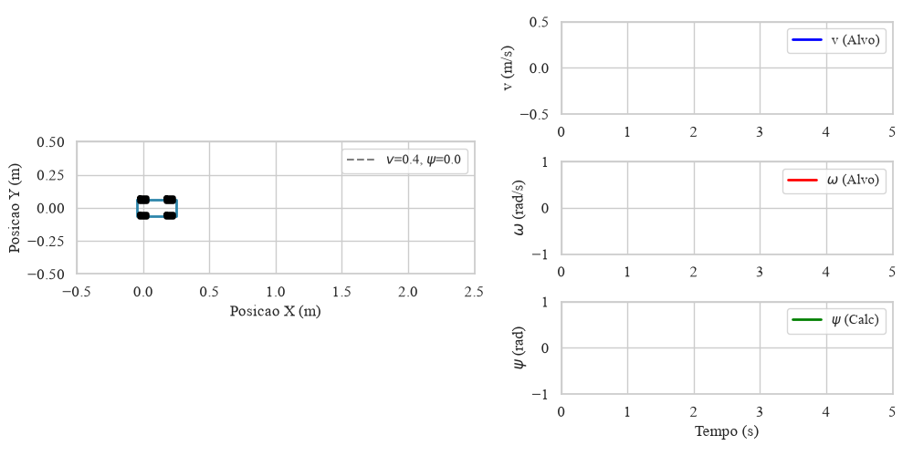
  <br>
  <em>Fonte: Elaborado pelo autor.</em>
</div>

### Movimentação para Trás

De forma análoga, o comando de entrada é uma velocidade linear negativa ($v = -0.4$ m/s) com velocidade angular nula. A cinemática inversa retorna esterçamento nulo, resultando em um deslocamento retilíneo em marcha à ré.

<div align="center">
  <em>Figura 2: Animação do movimento para trás.</em>
  <br>
  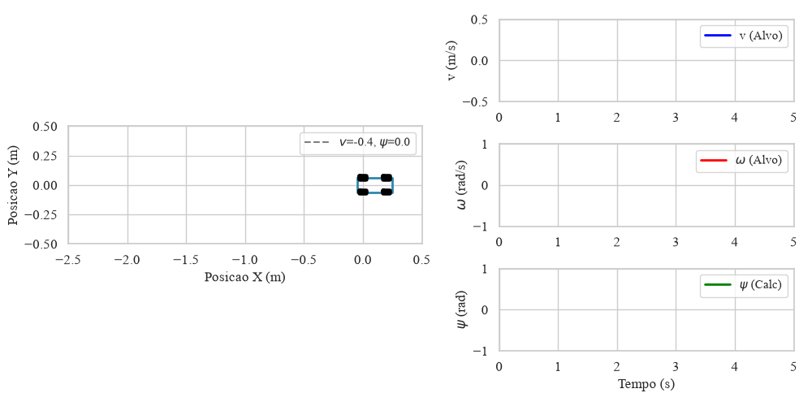
  <br>
  <em>Fonte: Elaborado pelo autor.</em>
</div>

### Curva à Esquerda

Para realizar uma curva à esquerda, o comando de entrada combina velocidade linear ($v = 0.4$ m/s) com velocidade angular positiva ($\omega = 0.6$ rad/s). A cinemática inversa calcula o ângulo de esterçamento positivo correspondente, direcionando as rodas dianteiras para a esquerda.

<div align="center">
  <em>Figura 3: Animação da curva à esquerda.</em>
  <br>
  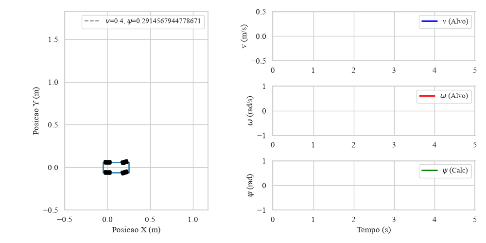
  <br>
  <em>Fonte: Elaborado pelo autor.</em>
</div>

### Curva à Direita

O comando de entrada combina velocidade linear ($v = 0.4$ m/s) com velocidade angular negativa ($\omega = -0.6$ rad/s). A cinemática inversa calcula o ângulo de esterçamento negativo, direcionando as rodas dianteiras para a direita.

<div align="center">
  <em>Figura 4: Animação da curva à direita.</em>
  <br>
  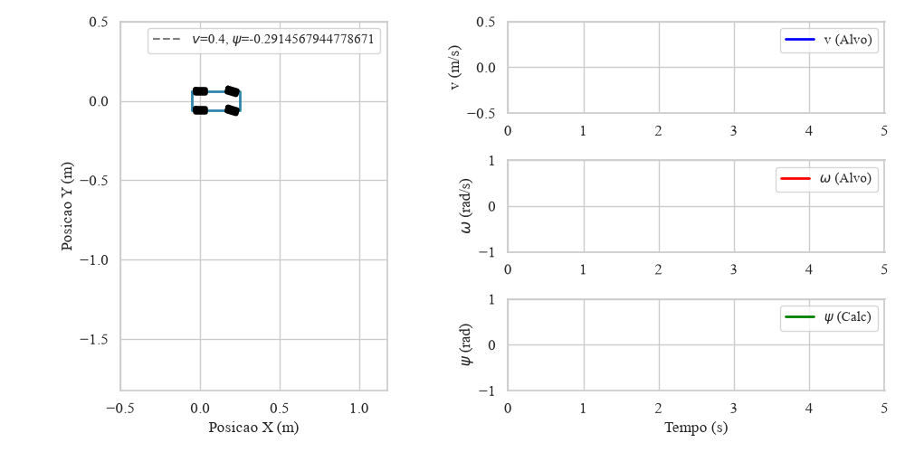
  <br>
  <em>Fonte: Elaborado pelo autor.</em>
</div>

## Simulação da Cinemática Direta via Integração Numérica

Nesta etapa, a velocidade linear $v$ e o ângulo de esterçamento $\psi$ são fornecidos diretamente como entrada, sem passar pela cinemática inversa. O algoritmo de integração de Euler calcula a postura contínua do veículo $(x(t), y(t), \theta(t))$ ao longo do tempo.

### Movimentação para Frente

O veículo recebe uma velocidade linear positiva ($v = 0.4$ m/s) com ângulo de esterçamento nulo ($\psi = 0$). A integração numérica produz um deslocamento retilíneo para frente, sem alteração na orientação.

<div align="center">
  <em>Figura 5: Animação do movimento para frente (Cinemática Direta).</em>
  <br>
  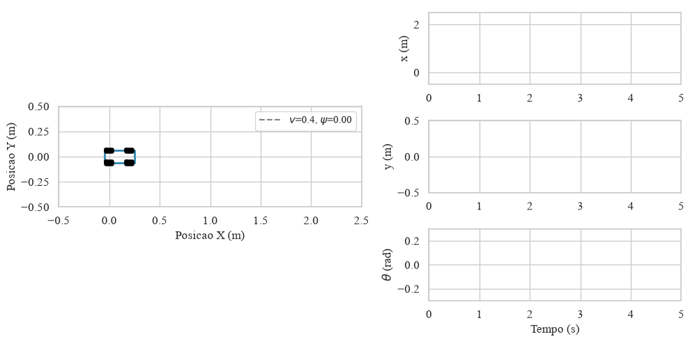
  <br>
  <em>Fonte: Elaborado pelo autor.</em>
</div>

### Movimentação para Trás

O veículo recebe uma velocidade linear negativa ($v = -0.4$ m/s) com ângulo de esterçamento nulo. A integração resulta em um deslocamento retilíneo em marcha à ré.

<div align="center">
  <em>Figura 6: Animação do movimento para trás (Cinemática Direta).</em>
  <br>
  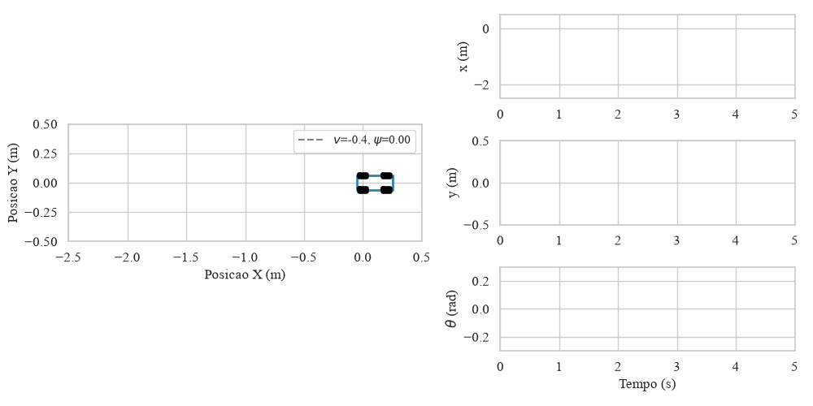
  <br>
  <em>Fonte: Elaborado pelo autor.</em>
</div>

### Curva à Esquerda

O veículo recebe velocidade linear ($v = 0.4$ m/s) com ângulo de esterçamento positivo ($\psi = 0.3$ rad). A integração numérica produz uma trajetória curvilínea com rotação no sentido anti-horário.

<div align="center">
  <em>Figura 7: Animação da curva à esquerda (Cinemática Direta).</em>
  <br>
  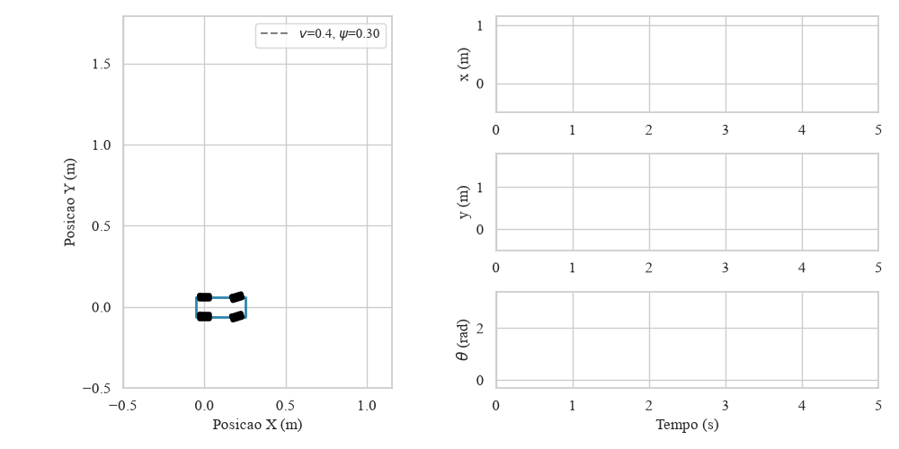
  <br>
  <em>Fonte: Elaborado pelo autor.</em>
</div>

### Curva à Direita

O veículo recebe velocidade linear ($v = 0.4$ m/s) com ângulo de esterçamento negativo ($\psi = -0.3$ rad). A integração numérica produz uma trajetória curvilínea com rotação no sentido horário.

<div align="center">
  <em>Figura 8: Animação da curva à direita (Cinemática Direta).</em>
  <br>
  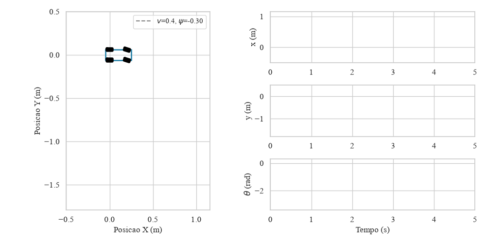
  <br>
  <em>Fonte: Elaborado pelo autor.</em>
</div>


## Como Executar

### Pré-requisitos Gerais
Para executar as simulações, você precisará das seguintes bibliotecas:
* Python 3.x
* NumPy
* Matplotlib
* Seaborn
* Pillow (para salvar os GIFs animados)

Instale as dependências usando o arquivo de requisitos:
```bash
pip install -r requirements.txt
```

### Simulando o Robô Diferencial
1. Acesse o diretório do diferencial:
   ```bash
   cd diferencial
   ```
2. Execute a simulação:
   ```bash
   python diferential_robot_kinematics.py
   ```
Os arquivos gerados serão salvos na sub-pasta `imagens`.

### Simulando o Robô Ackermann
1. Acesse o diretório do Ackermann:
   ```bash
   cd ackermann
   ```
2. Execute a simulação:
   ```bash
   python ackerman_kinematics.py
   ```
Os arquivos gerados serão salvos na sub-pasta `imagens`.

## Autor

Matheus Nunes Franco - 
Engenharia Mecatrônica - UFSC Joinville

## Referências

* LYNCH, Kevin M.; PARK, Frank C. **Modern Robotics - Mechanics, Planning, and Control**. Capítulo 13. Cambridge University Press.
* MathWorks. **Mobile Robot Kinematics Equations**. Disponível em: https://www.mathworks.com/help/robotics/ug/mobile-robot-kinematics-equations.html
